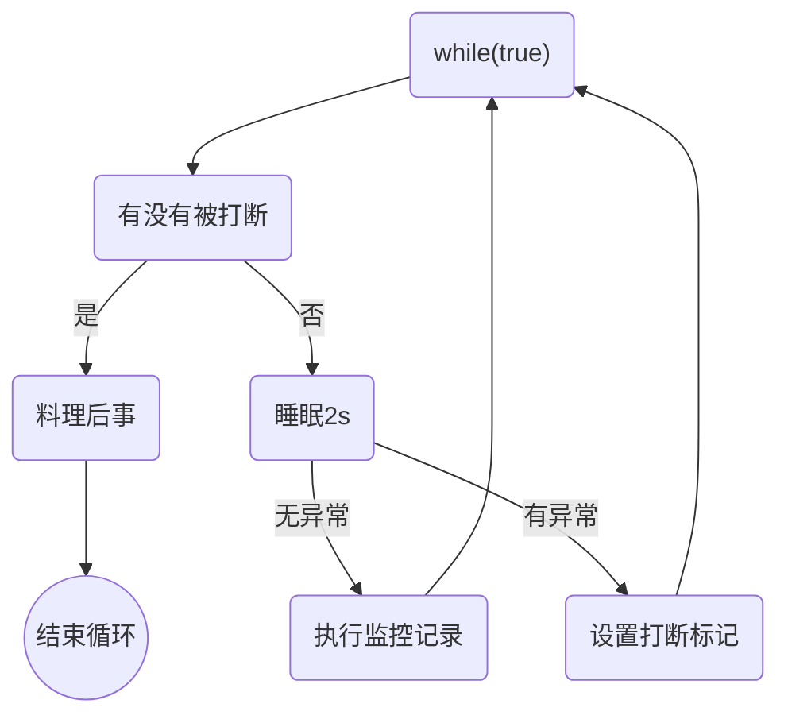
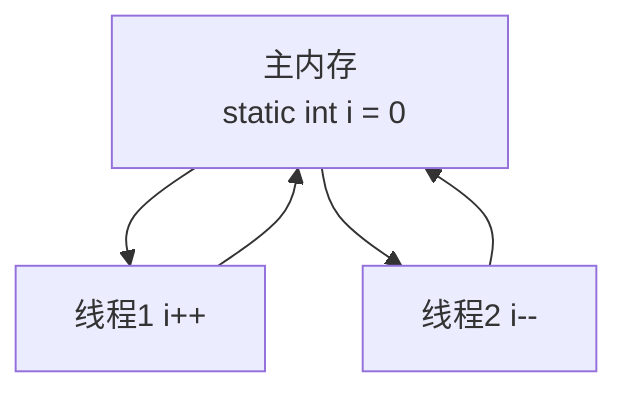
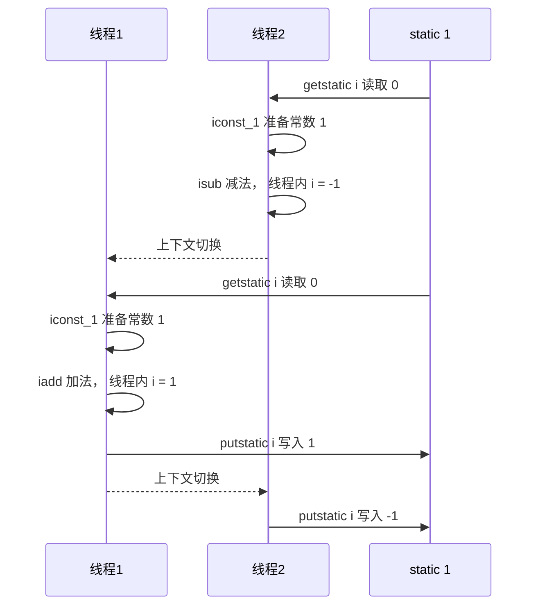
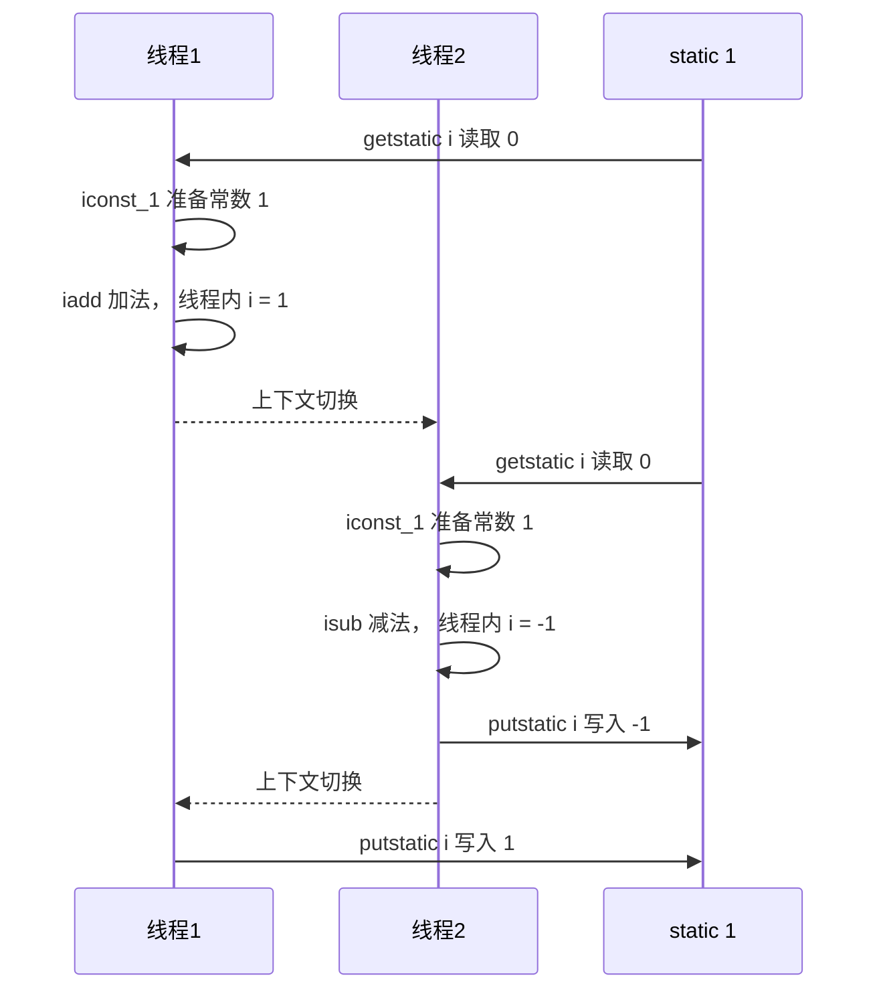
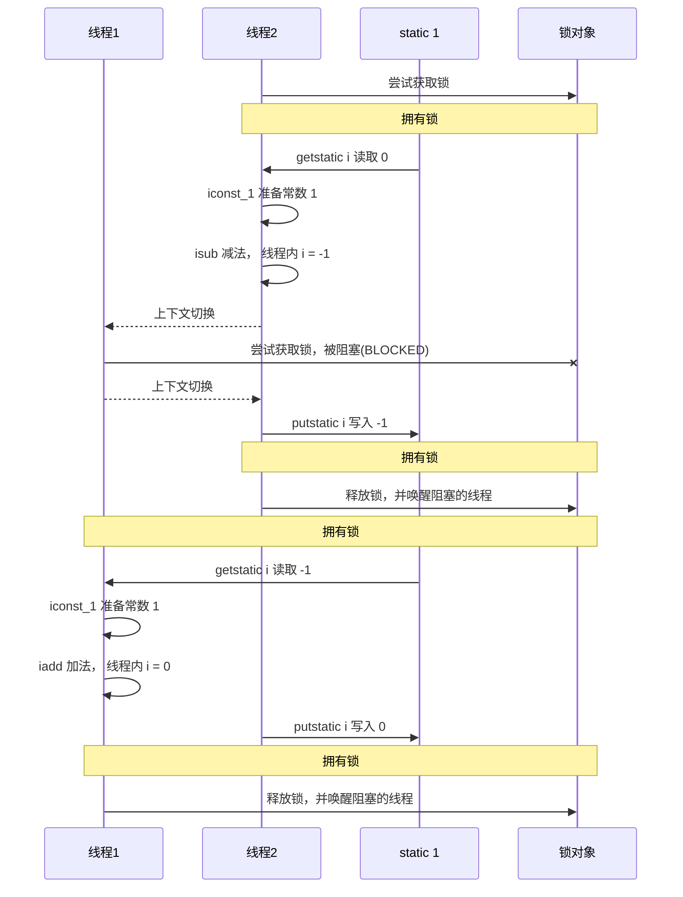
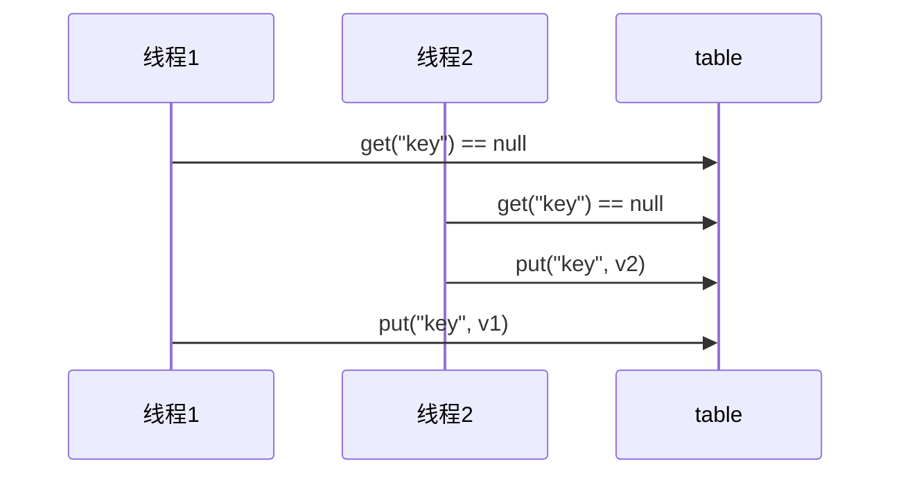

# 进程与线程

## 进程
* 程序由指令和数据组成，但这些指令要运行，数据要读写，就必须将指令加载至CPU，数据加载内存。在指令运行过程中还需要用到磁盘、网络等设备
* 当一个程序被运行，从磁盘加载这个程序的代码至内存，这时就开启了一个进程
* 进程可以看作程序的实例，大部分程序可以同时运行多个实例进程，也有的程序只能启动一个实例进程
## 线程
* 一个进程之内可以分为一到多个线程
* 一个线程就是一个指令流，将指令流中的一条条指令以一定的顺序交给CPU执行
* Java中，线程作为最小调度单位，进程作为资源分配的最小单位。在windows中进程是不活动的，只是作为线程的容器
## 二者对比
* 进程基本上相互独立的，而线程存在于进程内，是进程的一个子集
* 进程拥有共享的资源，如内存空间，供器内部的线程共享
* 进程间通信较为复杂
  * 同一台计算机的进程通信成为IPC(Inter-process communication)
  * 不同计算机之间的进程通信，需要通过网络，并遵守共同的协议，例如HTTP
* 线程通信相对简单，因为他们共享进程内的内存，一个例子是多个线程可以访问同一个共享变量
* 线程更轻量，线程上下文切换成本一般上要比进程上下文切换低

# 并行与并发
单核CPU下，线程实际还是串行执行的，操作系统中有一个组件叫做任务调度器，将cpu的时间片（windows下时间片最小约为15毫秒）分给不同的线程使用，只是由于cpu在线时间（时间片很短）的切换非常快，人类感觉是同时运行的。总结为一句话就是：*微观串行，宏观并行*
一般会将这种*线程轮流使用cpu*的做法成为并发：*concurrent* 
* 并发(concurrent) 是同一时间应对(dealing with) 多件事情的能力
* 并行(parallel)是同一时间动手做(doing)多件事情的能力
* 例子
  * 家庭主妇做饭、打扫卫生、给孩子喂奶，她一个人轮流做那么多事请，这就是并发
  * 家庭主妇雇佣了一个保姆，她们一起做这些事，这是既有并发，也有并行
  * 雇了3个保姆，一个专做饭，一个专门打扫卫生，一个喂奶，互不干扰，这就是并行

## 应用之异步调用（案例）
从方法调用角度来讲，如果：
* 需要等待结果返回，才能继续运行就是同步
* 不需要等待结果返回，就能继续运行就是异步
注意：同步在多线程中还有另一层意思，是让多个线程步调一致
1. 设计
   多线程可以让方法执行编程异步的，比如说读取磁盘文件时，假设读取操作花了5秒，如果没有线程调度机制，这五秒调用者什么都做不了，其代码都得暂停
2. 结论
   * 比如在项目中，视频文件需要转换格式等操作比较费时，这时候开启一个新的线程处理视频转换，避免阻塞主线程
   * tomcat的异步servlet也是类似的目的，让用户线程处理耗时较长的操作，避免阻塞tomcat的工作线程
   * ui程序中，开线程进行其他操作，避免阻塞ui线程

## 应用之提高效率（案例）
充分利用多核cpu的优势，提高运行效率。
* 注意使用多核cpu能够提高效率，单核任然是轮流执行
  环境搭建
   * 基准测试工具,使用了比较靠谱的JMH，它会执行程序预热，执行多次测试平均
   * cpu核心数限制，两种思路
     * 使用虚拟机
     * 使用msconfig，分配核心，要重启较麻烦

# Java线程 
## 创建和运行线程
* 方法一，直接使用Thread
``` java
Thread t = new Thread() {
  public void run() {
    //待执行任务
  }
};
t.start();
```
* 方法二，使用Runnable配合Thread
  * 把线程和任务分开
  * Tread表示线程
  * Runnable表示可运行的任务
``` java
Runnable runnable = new Runnable() {
  public void run() {
    // 内容
  }
};
Thread t = new Thread(runnable);
t.start();
```
* Java8以后可以使用lambda表达式精简代码
``` java
Runnable tast2 = () -> log.debug("hello");
```
## 原理Thread和Runnable的关系
* 方法一是把线程和任务合并在一起，方法二是把线程和任务分开了
* 用Runnable更容易与线程池等高级API配合
* 用Runnable让任务类摆脱了Thread继承体系，更灵活

* 方法三，FutureTask配合Thread
FutureTask能几首Callable类型的参数，用来处理有返回结果的情况
``` java
FutureTask<Integer> task3 = new FutureTask<>(() -> {
  log.debug("hello");
  return 100;
})

new Thread(task3, "t3").start();

Integer result = task.get();
log.debug("结果是:{}",result);
```

## 查看进程线程的方法
* windows
  * 任务管理器
  * tasklist
  * taskkill
* linux
  * ps -fe 查看所有进程
  * ps -fT -p \<PID> 
  * kill 杀死进程
  * top 按大写H切换是否显示线程
  * top -H -p \<PID> 
  * top -H -p \<PID> 
## 原理之线程运行
### 栈与栈帧
Java Virtual Machine Stacks(Java虚拟机)
我们都知道JVM中由堆、栈、方法区组成，其中栈内存是给谁用的？其实就是线程，每个线程启动后，虚拟机就会分配一块栈内存
* 每个栈由多个栈帧(Frame)组成，对应着每次方法调用时所占用的内存
* 每个线程只能有一个活动栈帧，对应着当前正在执行的那个方法
### 线程上下文切换(Thread Context Switch)
因为一些原因导致CPU v要砸u执行当前的线程，转而执行另一个线程的代码
* 线程的CPU的时间片用完
* 垃圾回收
* 有更高优先级的线程需要运行
* 线程自己调用了sleep、yield、wait、join、park、synchronized、lock等方法
当Context Switch发生时，需要由操作系统保存当前线程的状态，并恢复另一个线程的状态，Java中对应的概念就是程序计数器(Program Counter Register),它的作用是记录下一条jvm指令的执行地址，是线程私有的。
* 状态包括程序计数器、虚拟机中每个栈帧的信息，如果局部变量、操作数栈、返回地址等
* Context Switch 频繁发生会导致性能下降

## 常见方法
| 方法名     ---static    |                            功能说明                            | 注意                                                                                                                                                                      |
| :---------------------- | :------------------------------------------------------------: | :------------------------------------------------------------------------------------------------------------------------------------------------------------------------ |
| start()                 |         启动一个新线程，在新线程中运行run方法中的代码          | start方法只是让线程进入就绪，里面代码不一定立刻就允许(CPU的时间片还没分给它)。每个线程对象的start方法只能调用一次，如果调用了多次就会出现IllegalThreadStateException      |
| run()                   |                    新线程启动后会调用的方法                    | 如果在构造Thread对象时传递了Runnable参数，则线程启动后会调用Runnable的run方法，否则默认不执行任何操作。但可以创建Thread的子类对象，来覆盖默认行为                         |
| join()                  |                        等待线程运行结束                        |                                                                                                                                                                           |
| join(long n)            |                  等待线程运行结束,最多等n毫秒                  |                                                                                                                                                                           |
| getId()                 |                       获取线程长整型的id                       | id唯一                                                                                                                                                                    |
| getName()               |                           获得线程名                           |                                                                                                                                                                           |
| setName(String)         |                           修改线程名                           |                                                                                                                                                                           |
| getPriority()           |                         获得线程优先级                         |                                                                                                                                                                           |
| setPriority(int)        |                         修改线程优先级                         | java中规定线程优先级是1～10的整数，较大的优先级能够提高线程被cpu调度的几率                                                                                                |
| getState()              |                          获取线程状态                          | Java中栈状态是6个enum表示，表示为：NEW，RUNNABLE。BLOCKED，WAITING，TIMED_WAITING，TERMINATED                                                                             |
| isInterrupted()         |                        判断是否被打断                         | 不会清除 打断标记                                                                                                                                                         |
| isAlive()               |                  线程是否存活(还没有运行完毕)                  |                                                                                                                                                                           |
| interrupt()             |                            打断线程                            | 如果被打断正在sleep，wait，join会导致被打断的线程抛出InterruptedExecption，并清除打断标记；如果大段的正在运行的线程，则会设置打断标记；park的线程被打断，也会设置打断标记 |
| interrupt()   static    |                     判断当前线程是否被打断                     | 会清楚打断标记                                                                                                                                                            |
| currentThread()  static |                     获取当前正在执行的线程                     |                                                                                                                                                                           |
| sleep(long n)  static   | 让当前执行的县城休眠n毫秒，休眠时间让出cpu的实践篇给其它的线程 |                                                                                                                                                                           |
| yield()  static         |             提示线程调度器让出当前线程对cpu的使用              | 主要为了测试和调试                                                                                                                                                        |


## start与run
调用run方法程序仍然在main线程运行，FileReader.read()方法调用还是同步的
## sleep与yield
**sleep**
1. 调用sleep会让当前线程从Running进入Timed Waiting状态
2. 其它线程可以使用 interrupt方法打断正在睡眠的线程，这时sleep方法会抛出InterruptedException
3. 睡眠结束后的线程未必会立刻得到执行
4. 建议用TimeUnit的sleep代替Thread的sleep来获得更好的可读性
**yield**
1. 调用yield会让当前线程从Running进入Runnable状态，然后调度执行其他同优先级的线程。如果这时没有同优先级的线程，那么不能保证让当前线程暂停的效果
2. 具体的实现依赖于操作系统的任务调度器
**线程优先级**
* 线程优先级会提示会提示(hint)调度器优先调度该线程，但它仅仅是一个提示，调度器可以忽略它
* 如果cpu比较忙，那么优先级高的线程会获得更多的时间片，但CPU闲时，优先级几乎没作用

## 案例--防止CPU占用100%
### sleep实现
在没有利用cpu来计算时，不要让while(true)空转浪费cpu，这时可以使用yield或sleep来让出cpu的使用权给其他的程序
``` java
while(true) {
  try {
    Thread.sleep(50);
  } catch (InterruptedExceptino e){
    e.printStackTrace();
  }
}
```
* 可以用wait或条件变量达到类似的效果
* 不同的是，后两种都要加锁，并且需要相应的唤醒操作，一般适用于要进行同步的场景
* sleep适用于无需锁同步的场景

## join方法详解
### 为什么需要join？
下面的代码执行后，r输出什么？
``` java
static int r = 0;
public static void main(String[] args) throws InterruptedException {
    test1();
}

private static void test1() throws InterruptedException {
    log.debug("开始");
    Thread t1 = new Thread(() -> {
        log.debug("开始");
        sleep(1);
        log.debug("结束");
        r = 10;
    });
    t1.start();
    log.debug("结果为:{}",r);
    log.debug("结束");
}
```
* 因为主线程和线程t1是并行执行的，t1线程需要1s后才能算出r=10
* 而主线程从一开始就要打印r的结果，所以只能打印出r=0

* 用join 只用加载t1.start()后即可
``` java
    static int r = 0;
    public static void main(String[] args) throws InterruptedException {
        test1();
    }

    private static void test1() throws InterruptedException {
        log.debug("开始");
        Thread t1 = new Thread(() -> {
            log.debug("开始");
            sleep(1);
            log.debug("结束");
            r = 10;
        });
        t1.start();
        t1.join();
        log.debug("结果为:{}",r);
        log.debug("结束");
    }
```

## 应用同步【案例1】
以调用角度来讲
* 需要等待结果返回后，才能继续运行就是同步
* 不需要等待结果返回，就能继续运行就是异步
``` java
package makotogu.n3;

import lombok.extern.slf4j.Slf4j;

import static makotogu.n2.util.Sleeper.sleep;


@Slf4j(topic = "c.TestJoin")
public class TestJoin {
    static int r = 0;
    static int r1 = 0;
    static int r2 = 0;

    public static void main(String[] args) throws InterruptedException {
        test3();
    }

    public static void test3() throws InterruptedException {
        Thread t1 = new Thread(() -> {
           sleep(2);
           r1 = 10;
        });
        long start = System.currentTimeMillis();
        t1.start();

        log.debug("join begin");
        t1.join(1500);
        long end = System.currentTimeMillis();
        log.debug("r1:{}, cost:{}",r1, end-start);
    }

    private static void test2() throws InterruptedException {
        Thread t1 = new Thread(() -> {
            sleep(1);
            r1 = 10;
        },"t1");
        Thread t2 = new Thread(() -> {
            sleep(2);
            r2 = 20;
        },"t2");
        t1.start();
        t2.start();
        long start = System.currentTimeMillis();
        log.debug("join begin");
        t2.join();
        log.debug("t2 join end");
        t1.join();
        log.debug("t1 join end");
        long end = System.currentTimeMillis();
        log.debug("r1:{}, r2:{}, cost:{}", r1, r2, end-start);
    }
    
    private static void test1() throws InterruptedException {
        log.debug("开始");
        Thread t1 = new Thread(() -> {
            log.debug("开始");
            sleep(1);
            log.debug("结束");
            r = 10;
        });
        t1.start();
        t1.join();
        log.debug("结果为:{}",r);
        log.debug("结束");
    }


}

```

## interrupt方法详解
### 打断sleep，wait，join的线程
阻塞
打断sleep的线程，会清空打断状态，以sleep为例
``` java
package makotogu.test;

import lombok.extern.slf4j.Slf4j;

@Slf4j(topic = "c.Test12")
public class Test12 {

    public static void main(String[] args) throws InterruptedException {
        Thread t1 = new Thread(() -> {
           while(true){
               boolean interrupted = Thread.currentThread().isInterrupted();
               if (interrupted){
                   log.debug("被打断了，推出循环");
                   break;
               }
           }
        },"t1");
        t1.start();
        Thread.sleep(1000);
        log.debug("interrupt");
        t1.interrupt();
    }
}
```
## 两阶段中止模式
Two Phase Termination
在一个线程T1中如何优雅的终止线程T2？这里的优雅是指给T2一个料理后事的机会
### 错误思路
* 使用线程对象的stop方法停止线程
  * stop会真正杀死线程。如果这时线程锁住了共享资源，那么当它被杀死后就再也没机会释放锁，其他线程也永远无法获取锁
* 使用System.exit(int)方法停止线程
  * 目的仅是停止一个线程，但这个做法会让整个程序停止



### 打断park线程
打断park线程，不会清空打断状态


## 主线程与守护线程
默认情况下，Java进程需要等待所有线程都运行结束，才会结束。有一种特殊的线程叫做守护线程，只要其他非守护线程运行完了，即使守护线程的代码没有执行完，也会强制结束

* 垃圾回收器线程就是一种守护线程
* Tomcat中Acceptor和Poller线程都是守护线程，所以Tomcat接收到shutdown命令后，不会等待它们处理完当前请求

## 线程状态--五种状态
### 从操作系统层面描述
* 【初始状态】 仅是在语言层面创建了线程对象，还未与操作系统线程关联
* 【可运行状态】 (就绪状态)指线程已被创建（与操作系统线程关联），可以由CPU调度执行
* 【运行状态】 只获取了CPU时间片运行中的状态
  * 当CPU时间片用完，会从【运行状态】转换至【可运行状态】，会导致线程上下文切换
* 【阻塞状态】
  * 如果调用了阻塞API，如BIO读写文件，这时该线程实际不会用到CPU，会导致线程上下文切换，进入【阻塞状态】
  * 等BIO操作完毕，会由操作系统唤醒阻塞的线程，转换至【可运行状态】
  * 与【可运行状态】的区别是，对【阻塞状态】的线程来说只要它们一直不唤醒，调度器就一直不会考虑调度它们
* 【终止状态】表示线程已经执行完毕，生命周期已经结束，不会再转换为其他状态

## 线程状态--六种状态
### 从Java API层面描述 Thread.State
* NEW 线程刚刚被创建，但是还没有start()方法调用
* RUNNABLE 当调用start()方法后，注意，Java API层面的RUNNABLE状态涵盖了操作系统层面的【可运行状态】、【运行状态】和【阻塞状态】(由于BIO导致的线程的阻塞，在Java里无法区分，仍然是可运行的)
* WAITING、 TIMED WAITING、 BLOCKED 都是Java API层面对【阻塞状态】的细分，后面会在状态转换内细述
* TERMINATED 当线程代码运行结束

#### 统筹方法 习题
* 泡茶工序
   1. 甲：洗水壶，烧水；在等烧水的时间洗茶壶茶杯；等水开了泡茶喝
   2. 乙：洗水壶，洗茶壶，拿茶叶；再去烧水；再去泡茶


# 共享模型之管程

## 共享带来的问题

``` java
package makotogu.test;

import lombok.extern.slf4j.Slf4j;

@Slf4j(topic = "c.Test17")
public class Test17 {
    static int counter = 0;
    public static void main(String[] args) throws InterruptedException {
        Thread t1 = new Thread(() -> {
            for (int i = 0; i < 5000; i++) {
                counter++;
            }
        }, "t1");
        Thread t2 = new Thread(() -> {
            for (int i = 0; i < 5000; i++) {
                counter--;
            }
        }, "t2");

        t1.start();
        t2.start();
        t1.join();
        t2.join();
        log.debug("{}",counter);

    }
}

```

输出结果不是0

### 问题分析

从字节码去理解

**i++**

``` tex
getstatic i // 获取静态变量i的值
iconst_1 // 准备常量1
iadd // 自增
putstatic // 将修改过后的值存入静态变量i
```







### 临界区 Critical Section

* 一个程序运行多个线程本身没有问题
* 问题出现在多个线程访问**共享资源**
  * 多个线程读**共享资源**也没问题
  * 再多个线程对**共享资源**读写操作时发生指令交错，就会出现问题
* 一段代码块内如果存在对**共享资源**的多线程读写操作，称这段代码为临界区

``` java
static int counter = 0;
static void increment() {
    // 临界区
    counter++;
}
static void decrement() {
    // 临界区
    counter--;
}
```

### 竞态条件 Race Condition

多个线程在临界区内执行，由于代码的执行序列不同而导致结果无法预测，称之为发生了**竞态条件**

## synchronized 解决方案

### <font color="green"> * 应用之互斥</font>

为了避免临界区的竞态条件发生，有多重手段可以达到目的

* 阻塞式的解决方案: synchronized， Lock
* 非阻塞式的解决方案: 原子变量


### synchronized

语法

``` java
synchronized (对象) {
    临界区
}
```

解决问题

``` java
package makotogu.test;

import lombok.extern.slf4j.Slf4j;

@Slf4j(topic = "c.Test17")
public class Test17 {
    static int counter = 0;
    static Object lock= new Object();
    public static void main(String[] args) throws InterruptedException {
        Thread t1 = new Thread(() -> {
            for (int i = 0; i < 5000; i++) {
                synchronized (lock) {
                    counter++;
                }
            }
        }, "t1");
        Thread t2 = new Thread(() -> {
            for (int i = 0; i < 5000; i++) {
                synchronized (lock) {
                    counter--;
                }
            }
        }, "t2");

        t1.start();
        t2.start();
        t1.join();
        t2.join();
        log.debug("{}",counter);

    }
}

```


用图来表示



* 如果将synchronized放在for循环外面会怎么样？
  * 粒度过大，整个for运行完才会到下一个 -- 原子性
* 如果 t1 synchronized(obj1 ) 而 t2 synchronized(obj2)会怎么样运作？
  * 会各管各，没有效果 -- 锁对象
* 如果t1 synchronized(obj) 而 t2没加会怎么样？
  * 会没有获取锁的动作 -- 锁对象

### 面向对象改造

``` java
package makotogu.test;

import lombok.extern.slf4j.Slf4j;

@Slf4j(topic = "c.Test17")
public class Test17 {
    static int counter = 0;
    public static void main(String[] args) throws InterruptedException {
        Room room = new Room();
        Thread t1 = new Thread(() -> {
            for (int i = 0; i < 5000; i++) {
                room.increment();
            }
        }, "t1");
        Thread t2 = new Thread(() -> {
            for (int i = 0; i < 5000; i++) {
                room.decrement();
            }
        }, "t2");

        t1.start();
        t2.start();
        t1.join();
        t2.join();
        log.debug("{}",room.getCounter());

    }
}

class Room {
    private int counter = 0;
    public void increment() {
        synchronized (this) {
            counter++;
        }
    }
    public void decrement() {
        synchronized (this) {
            counter--;
        }
    }

    public int getCounter() {
        synchronized (this) {
            return counter;
        }
    }
}

```

## 方法上的synchronized

``` java
class Test {
  public synchronized void test() {
    
  }
}

// 等价于
 class Test {
   public void test() {
     synchronized (this) {
       
     }
   }
 }
```

```java
class Test {
  public synchronized static void test() {
    
  }
}

// 等价于
 class Test {
   public void test() {
     synchronized (Test.class) {
       
     }
   }
 }
```

### 所谓的“线程八锁”

考察锁住哪个对象

``` java
package makotogu.n4;

import lombok.extern.slf4j.Slf4j;

import static makotogu.n2.util.Sleeper.sleep;

@Slf4j(topic = "c.Test8Lock")
public class Test8Locks {
    public static void main(String[] args) {
        Number n1 = new Number();
        Number n2 = new Number();
        new Thread(() -> {
            log.debug("begin");
            n1.a();
        }).start();
        new Thread(() -> {
            log.debug("begin");
            n2.b();
        }).start();
//        new Thread(() -> {
//            log.debug("begin");
//            n1.c();
//        }).start();
    }
}

/**
 * 第一种的Number类 锁方法，同一个对象this
 */
/*@Slf4j(topic = "c.Number")
class Number {
    public synchronized void a() {
        log.debug("1");
    }
    public synchronized void b() {
        log.debug("2");
    }
}*/

/**
 * 和第一种相比多了一个sleep方法
 * sleep不解除锁
 */
/*
@Slf4j(topic = "c.Number2")
class Number {
    public synchronized void a() {
        sleep(1);
        log.debug("1");
    }
    public synchronized void b() {
        log.debug("2");
    }
}
*/

/**
 * 增加一个 c方法 不加锁
 * 没有互斥效果，并行执行
 * 1不可能最先 有1s的sleep
 */
/*
@Slf4j(topic = "c.Number3")
class Number {
    public synchronized void a() {
        sleep(1);
        log.debug("1");
    }
    public synchronized void b() {
        log.debug("2");
    }
    public void c() {
        log.debug("3");
    }
}*/

/**
 * main方法改动有两个对象 n1调用a n2调用b
 * 不是同一个对象，所以不会互斥，2总是先于1打印
 */
/*@Slf4j(topic = "c.Number4")
class Number {
    public synchronized void a() {
        sleep(1);
        log.debug("1");
    }
    public synchronized void b() {
        log.debug("2");
    }
}*/

/**
 * 一个静态锁，一个普通方法的锁，对象不同
 * 打印情况和4一样
 */
/*
@Slf4j(topic = "c.Number5")
class Number {
    public synchronized static void a() {
        sleep(1);
        log.debug("1");
    }
    public synchronized void b() {
        log.debug("2");
    }
}*/

/**
 * 两个都是static情况
 * 和情况2一样打印
 */
/*
@Slf4j(topic = "c.Number6")
class Number {
    public synchronized static void a() {
        sleep(1);
        log.debug("1");
    }
    public synchronized static void b() {
        log.debug("2");
    }
}*/

/**
 * 使用n1和n2调用方法
 */
/*@Slf4j(topic = "c.Number7")
class Number {
    public synchronized void a() {
        sleep(1);
        log.debug("1");
    }
    public synchronized static void b() {
        log.debug("2");
    }
}*/

/**
 * n1 n2调用静态 走Number.class
 */
@Slf4j(topic = "c.Number8")
class Number {
    public synchronized static void a() {
        sleep(1);
        log.debug("1");
    }
    public synchronized static void b() {
        log.debug("2");
    }
}
```

## 变量的线程安全分析

### 成员变量和静态变量是否线程安全？

* 如果它们没有共享，则线程安全
* 如果它们被共享了，根据它们的状态是否能够改变，又分两种情况
  * 如果只有读操作，则线程安全
  * 如果有读写操作，则这段代码都是临界区需要考虑线程安全

### 局部变量是否线程安全

* 局部变量是线程安全的
* 但局部变量引用的对象则未必
  * 如果该对象没有逃离方法的作用范围，它是线程安全的
  * 如果该对象逃离方法的作用范围，需要考虑线程安全

### 局部变量的线程安全分析

``` java
public static void test1() {
  int i = 10;
  i++;
}
```

```java
public static void test1() {
  descriptor: ()V
  flags: ACC_PUBLIC, ACC_STATIC
  Code:
  	stack=1, locals=1, arg_size=0
      0: bipush				10
      2: istore_0
      3: iinc	        0, 1
      6: return
    LineNumberTable:
  		line 10 : 0
      line 11 : 3
      line 12 : 6
    LocalVariableTable:
  		Start  Length  Slot  Name  Signature
        3      4      0      i      I
}
```


### 常见线程安全类

* String
* Integer
* StringBuffer
* Random
* Vector
* Hashtable
* java.util.concurrent包下的类

这里说的线程安全是指，多个线程调用它们同一个实例的某个方法时，是线程安全的，也可以理解为

* 它们的每个方法是原子的
* 但注意它们多个方法的组合不是原子的

### 线程安全类方法的组合

分析下面代码是否线程安全？

```java
Hashtable table = new Hashtable();
// 线程1， 线程2
if (table.get("key") == null) {
  table.put("key",value);
}
```




